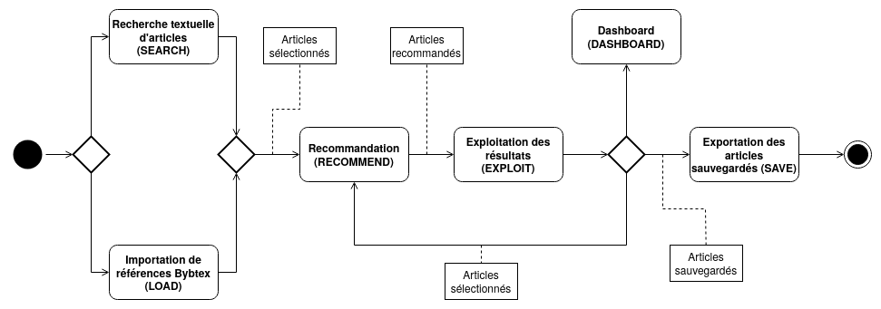
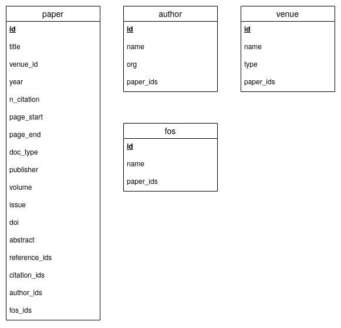

# CETIC - Recommender System - Prototype

## Description

This research-paper recommendation system aims to help the researcher in his bibliographical
search by being an alternative to traditional search engines. It recommends papers on the
basis of a selection of papers proposed by the user. In contrast to conventional
recommendation systems which are based on a one-shot interaction scenario, this system can
work iteratively by using precedent recommendations as inputs for the next ones. The main way
to use it is shown in the activity diagram below:



This app uses a PostgreSQL database and an Elasticsearch instance as data sources.
The used dataset is DBLP-Citation-network V12 (https://www.aminer.org/citation).
(See other repo for data loading scripts)

PostgreSQL schema:



Elasticsearch schema:

```json
{
  "dblp_v12_v2" : {
    "mappings" : {
      "properties" : {
        "abstract" : {
          "type" : "text",
          "similarity" : "scripted_tfidf"
        },
        "doi" : {
          "type" : "text",
          "fields" : {
            "keyword" : {
              "type" : "keyword",
              "ignore_above" : 256
            }
          }
        },
        "fos" : {
          "type" : "text",
          "fields" : {
            "keyword" : {
              "type" : "keyword",
              "ignore_above" : 256
            }
          }
        },
        "linked_papers" : {
          "type" : "long"
        },
        "paper_id" : {
          "type" : "long"
        },
        "title" : {
          "type" : "text",
          "similarity" : "scripted_tfidf"
        }
      }
    }
  }
}
```

Description of the main files :
 - `static/` : *.css and *.js files
 - `templates/` : *.html files
 - `__init__.py` : app init
 - `config.py` : app and db parameters (not include in the repo)
 - `dashboard.py` : DASHBOARD module
 - `db.py` : db access and methods
 - `exploit.py` : EXPLOIT module
 - `index.py` : INDEX module
 - `load.py` : LOAD module
 - `rank.py` : ranking functions (used by EXPLOIT module)
 - `recommend.py` : RECOMMEND module
 - `recommend_methods.py` : recommend methods (used by RECOMMEND module)
 - `save.py` : SAVE module
 - `search.py` : SEARCH module
 - `utilities.py` : utility functions (used for reference formatting and session
 variable management)

## Sources

This prototype was developed by Julien Albert, master student in CS at UNamur, during his
internship at the CETIC, under the supervision of Mathieu Goeminne (CETIC) and Benoît
Frenay (UNamur).

Master's Thesis : https://researchportal.unamur.be/fr/studentTheses/conception-dun-syst%C3%A8me-de-recommandation-de-litt%C3%A9rature-scientifi

App source : https://flask.palletsprojects.com/en/1.1.x/tutorial/

Template source : https://getbootstrap.com/docs/4.4/examples/dashboard/
